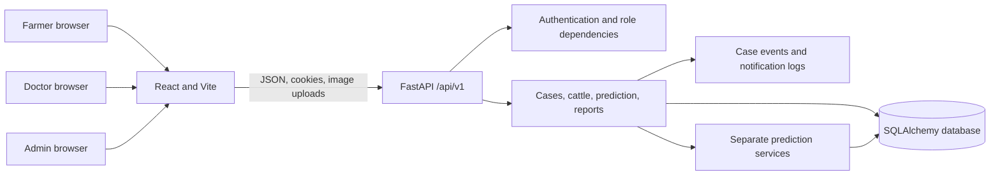
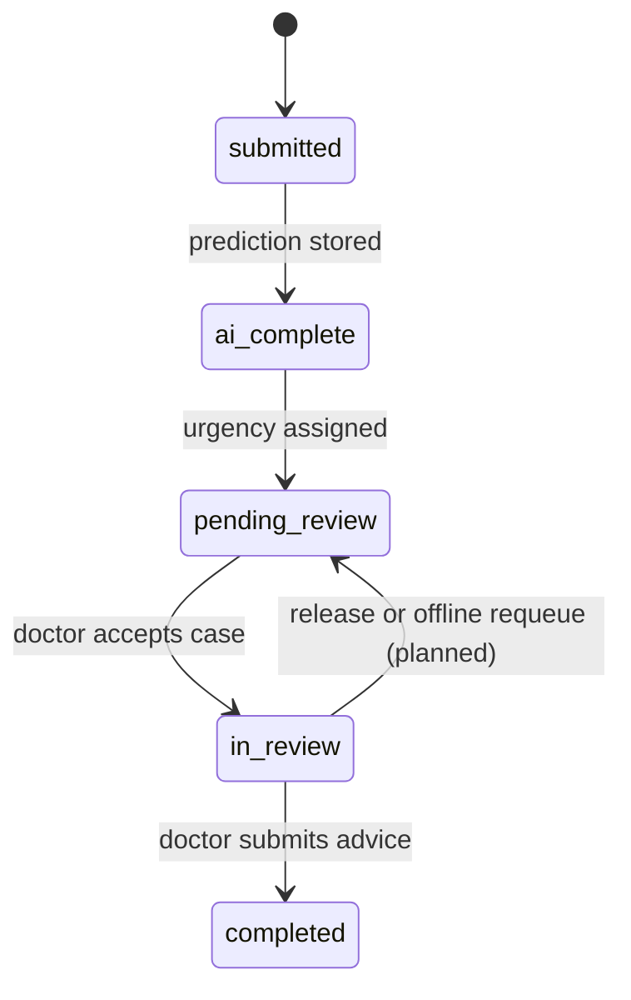

# BoviCare

BoviCare is an AI-assisted cattle health triage and veterinarian consultation platform for India. Farmers can register cattle, submit a health check, review decision-support results, and follow case progress. Doctors can review cases and provide farmer-facing advice. The application supports English, Hindi, and Marathi in its current farmer flows; language coverage is not yet complete across every screen.

> AI results are decision support, not a veterinary diagnosis. A qualified veterinarian must assess the animal. Urgency scores and class severities are design choices and need clinical review. The application does not provide medication names or doses.

## Features

- Farmer accounts, cattle registry, case triage, image upload, separate prediction outputs, case history, and PDF reports.
- Doctor case queue, case review, advice, report download, and availability badges in existing views.
- Admin account seeding from environment variables.
- Case events, urgency fields, doctor verification metadata, notifications, and database migrations.
- A development-only demo seed script that targets a separate database.

The image-class characteristics are concise summaries of veterinary references: [WOAH on FMD](https://www.woah.org/en/disease/foot-and-mouth-disease/), [WOAH on lumpy skin disease](https://www.woah.org/en/disease/lumpy-skin-disease/), and the MSD Veterinary Manual on [IBK](https://www.msdvetmanual.com/eye-diseases-and-disorders/infectious-keratoconjunctivitis/infectious-keratoconjunctivitis-in-cattle-and-small-ruminants), [ringworm](https://www.msdvetmanual.com/integumentary-system/dermatophytosis/dermatophytosis-in-cattle), [lice](https://www.msdvetmanual.com/integumentary-system/lice/lice-in-cattle), and [dermatophilosis](https://www.msdvetmanual.com/integumentary-system/dermatophilosis/dermatophilosis-in-animals). Severity bands in the UI are BoviCare triage labels and need veterinarian review.

The current server does not yet expose all planned workflows. Admin doctor approval, a verified-doctor access gate, a server-side filtered priority inbox, global notification endpoints, availability updates/offline requeue, and a fully role-specific admin workspace are outstanding. See [docs/API_CONTRACT.md](docs/API_CONTRACT.md) if present in your checkout; no contract is currently published in this repository.

## Stack

| Area | Technology |
| --- | --- |
| Web client | React, Vite, Tailwind CSS 3, React Router, Axios, Lucide |
| API | FastAPI, Pydantic, SQLAlchemy |
| Database | SQLite for local development; PostgreSQL supported through SQLAlchemy and Alembic |
| ML | Separate symptom, milk/mastitis, and legacy image predictors; a frozen seven-class image checkpoint is stored separately |
| Reports | ReportLab PDF generation |

## Setup

### Backend

From `backend/`, create and activate a virtual environment, install dependencies, configure environment variables, migrate, and start the API:

```powershell
python -m venv .venv
.\.venv\Scripts\Activate.ps1
pip install -r requirements.txt
Copy-Item .env.example .env
python -m alembic upgrade head
uvicorn app.main:app --reload
```

Use a `SECRET_KEY` of at least 32 bytes. Set `ADMIN_EMAIL` and `ADMIN_PASSWORD` before startup to seed an administrator when none exists. Production startup fails clearly if no admin exists and those variables are missing. The API does not create or alter schema at startup; apply migrations as a deployment step.

### Frontend

From `frontend/`:

```powershell
npm ci
npm run dev
npm run lint
npm test
npm run build
```

Set `VITE_API_BASE_URL` to the API root when it is not `http://localhost:8000/api/v1`.

### Development demo dataset

The demo script always selects `backend/bovicare_demo.db`; it ignores a caller-provided `DATABASE_URL` and refuses to run unless `ENV=development` is explicit. It also disables `.env` file loading for that process. It applies migrations to that demo file and adds synthetic records idempotently. It never targets `backend/bovicare.db` or the repository-root `bovicare.db`.

Configure `ADMIN_EMAIL`, `ADMIN_PASSWORD`, and `DEMO_USER_PASSWORD` in the shell (do not commit them), then run from `backend/`:

```powershell
$env:ENV = 'development'
$env:ADMIN_EMAIL = 'admin@example.test'
$env:ADMIN_PASSWORD = '<provide a private password>'
$env:DEMO_USER_PASSWORD = '<provide a private password>'
python scripts/seed_demo.py
```

The dataset contains one admin, two approved doctors, one pending doctor, one farmer, four cattle, and approximately 20 synthetic cases spanning all five workflow statuses, all three urgency levels, and different dates. Doctor/farmer demo accounts use `DEMO_USER_PASSWORD`; the administrator uses `ADMIN_PASSWORD`. The script prints account names only, never passwords. Synthetic clinical text is not medical advice.

## Database migrations

From `backend/`:

```powershell
python -m alembic upgrade head
python -m alembic current
```

For an existing pre-Alembic database, take a backup and verify its schema against the baseline before stamping it. Do not stamp an unknown schema. SQLite migrations use batch mode for table changes; PostgreSQL is supported by Alembic and SQLAlchemy.

## Architecture



## Case workflow

The intended status values are `submitted → ai_complete → pending_review → in_review → completed`. A submission should be recorded first, then prediction completion and review queue entry; a doctor claim begins review, and advice completes the case. `case_events` records status changes for the timeline. The current route set transitions status after prediction and when a case is claimed or reviewed, but not every planned notification, verification, and requeue behavior is implemented yet.



## Urgency score

The pure calculation is in `backend/app/services/urgency.py`; `backend/app/routers/cases.py` stores its result and breakdown. It caps the score at 100 and uses `HIGH >= 70`, `MEDIUM >= 40`, otherwise `LOW`. The disease finding and confidence each use the maximum across separate model outputs; they are never averaged.

| Component | Current calculation and constants | Maximum |
| --- | --- | ---: |
| Disease severity | `SEVERITY_POINTS`: high/urgent = 30; medium = 15; low = 5; unknown = 0. `DISEASE_SEVERITY`: FMD/LSD high; ringworm/IBK/pediculosis/dermatophilosis medium; healthy low. | `DISEASE_SEVERITY_WEIGHT = 30` |
| AI confidence | Highest stored prediction probability × weight. Missing/invalid confidence contributes 0. | `AI_CONFIDENCE_WEIGHT = 25` |
| Symptom count | `SYMPTOM_POINTS_EACH = 4`; `MAX_SYMPTOMS_COUNTED = 5`; symptom points cap at 20. | `SYMPTOM_COUNT_WEIGHT = 20` |
| Waiting time | `WAITING_TIME_SATURATION_HOURS = 12`; waiting points are 15 × hours ÷ 12, capped at 15. | `WAITING_TIME_WEIGHT = 15` |
| Animal age | `AGE_RISK_MODERATE_YEARS = 3` → 3 points; `AGE_RISK_ELEVATED_YEARS = 5` → 6; `AGE_RISK_HIGH_YEARS = 8` → 10. | `ANIMAL_AGE_RISK_WEIGHT = 10` |
| Bands and cap | `HIGH_URGENCY_MIN = 70`; `MEDIUM_URGENCY_MIN = 40`; lower scores are LOW; `MAX_URGENCY_SCORE = 100`. | 100 total |

Confidence and severity are selected by maximum, not averaged. The service maps the seven image labels to HIGH/MEDIUM/LOW severity and also considers each output's risk level. These weights, age cutoffs, and disease severity assignments are design choices, not validated clinical cutoffs.

## Security notes

- Backend routes must enforce role checks; frontend route guards are not an authorization boundary.
- Farmer-facing case responses must never include `clinical_notes`, `private_clinical_notes`, or private veterinarian note aliases. Regression coverage checks the API response body.
- Refresh tokens are stored as hashes in the database and sent in an HttpOnly cookie. Use HTTPS and secure cookie settings in production.
- Keep `.env`, database files, uploads, logs, and backups out of source control. Never put passwords or `SECRET_KEY` in source code. `SECRET_KEY` must be at least 32 bytes.
- Apply Alembic migrations before API startup. Do not alter production schema during startup.
- Review access control on every new endpoint and keep all model output groups separate.

## Limitations and known gaps

- The active prediction service uses the symptom predictor; `backend/ml/final_model/` contains frozen seven-class image weights, but the API does not currently load that checkpoint.
- `backend/ml/models/` contains legacy metadata for earlier three-class and two-class MobileNet models. See [backend/ml/models/README.md](backend/ml/models/README.md). No model weights were changed.
- Urgency age cutoffs and disease severity assignments are design choices and have not been clinically validated.
- No browser automation runner is configured in this checkout. Full viewport-specific end-to-end coverage at 360, 768, and 1280 pixels has not been performed.
- Doctor verification/admin approval, comprehensive wrong-role access coverage for all planned routes, background offline requeue, global notifications, idle logout, and complete English/Hindi/Marathi audit remain incomplete.
- AI outputs and demo data must not be treated as confirmed diagnosis or treatment advice.

## Screenshots

Add reviewed product screenshots here when available. Do not use screenshots containing real farmer, animal, contact, or clinical information.
